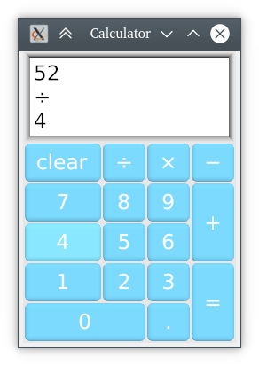

KAS GUI
==========

[](https://github.com/dhardy/kas)
[](https://gitlab.com/dhardy/kas)

KAS is the *toolKit Abstraction System*. It comprises:

-   `kas`: the *core* of the GUI library, providing core interfaces and types,
    standard widgets, widget layout and event handling
-   `kas_macros`: a helper crate providing the procedural macros used by `kas`
-   `kas_wgpu`: an interface to [`winit`] and [`wgpu`], providing windowing and
    hardware-accelerated rendering

A user depends on `kas` to write their complete UI specification, and then
pastes a few lines of code to initialise `kas_wgpu::Toolkit`, add the window
and run the UI.

[`winit`]: https://github.com/rust-windowing/winit/
[`wgpu`]: https://github.com/gfx-rs/wgpu-rs


Examples
---------

Several examples are available on the `kas_wgpu` sub-crate. Try e.g.

```
cd kas-wgpu
cargo run --example calculator
```

 
 


Installation and Testing
------------------------

On Linux, ensure that [CMake](https://cmake.org/) is installed. On Linux this should be
available in your package manager. This is required by the GLSL compiler.
On Windows 10 it does not need to be installed explicitly.

Next, clone the repository and run the examples as follows:

```
git clone https://github.com/dhardy/kas.git
cd kas
cargo test
cd kas-wgpu
cargo test
cargo run --example gallery
```

### Cross-platform

KAS uses cross-platform libraries, allowing it to target all major platforms.
Current development & test targets:

-   Linux / X11
-   Linux / Wayland
-   Windows 10

### Graphics requirement

KAS uses [WebGPU](https://github.com/gfx-rs/wgpu) for rendering. This currently supports
DX11, DX12, Vulkan and Metal, but not OpenGL or unaccelerated rendering. See [issue 33](https://github.com/dhardy/kas/issues/33).


Features
----------

-   Custom parent widgets with embedded state (at in Qt)
-   Type-safe event handlers from the context of these widgets
-   Custom widgets over high- or low-level event API
-   Custom widgets over high-level draw API (TODO: low level option)
-   Flexible grid layouts with spans
-   Width-for-height calculations
-   Custom themes (with full control of sizing and rendering)
-   Touch-screen support
-   Keyboard navigation & accelerator keys
-   Fully scalable (hidpi)
-   Mult-window support
-   GPU-accelerated
-   Very memory and CPU efficient (aside from some pending optimisations)


Data model and specification
--------------

KAS is in part motivated by some of the common limitations of UIs:

-   specification is often redundant, requiring widgets to be created, added
    to a parent, sometimes forcing elements to be named when *any* custom
    properties are required
-   declarative specifications may need to be recreated frequently
-   user state (data) and UI models are often separated, making event handling
    and data transfer more difficult than ought be necessary

KAS takes some inspiration from Qt (but using macros in place of language
extensions), in that custom widget structs may combine user state and UI
components. Most of KAS is inspired by finding a maximally-type-safe, flexible
"Rustic" solution to the problem at hand.


Drawing and themes
--------

One of the key problems to solve in a UI is the question of *how are widgets
drawn?* Already, multiple approaches have been tried and abandoned:

-   `kas_gtk` used GTK to do the rendering; in practice this meant using GTK
    for event handling and widget layout too, and made building the desired API
    around GTK very difficult; an additional issue with this approach is that
    GTK libs can be difficult to install on some platforms
-   `kas_rgx` used RGX as a rendering API allowing custom widget rendering
    with a "mid-level graphics API"; ultimately this proved less flexible than
    desired while also lacking high-level drawing routines (e.g. pretty frames)

Thus, KAS has now moved to direct use of `wgpu` and `wgpu_glyph` for rendering,
providing its own high-level abstractions (the `Draw*` traits provided by
`kas` and `kas_wgpu`). This still needs fleshing out (more drawing primitives,
a better text API, and support for custom pipes & shaders), but looks to be a
viable path forward.

### Themes

A "theme" provides widget sizing and drawing implementations over the above
`Draw*` traits as well as a choice of fonts (and eventually icons).

Currently a single `SampleTheme` is provided, along with a custom theme example.


Copyright and Licence
-------

The <COPYRIGHT> file includes a list of contributors who claim copyright on this
project. This list may be incomplete; new contributors may optionally add
themselves to this list.

The KAS library is published under the terms of the Apache License, Version 2.0.
You may obtain a copy of this licence from the <LICENSE-APACHE> file or on
the following webpage: <https://www.apache.org/licenses/LICENSE-2.0>
